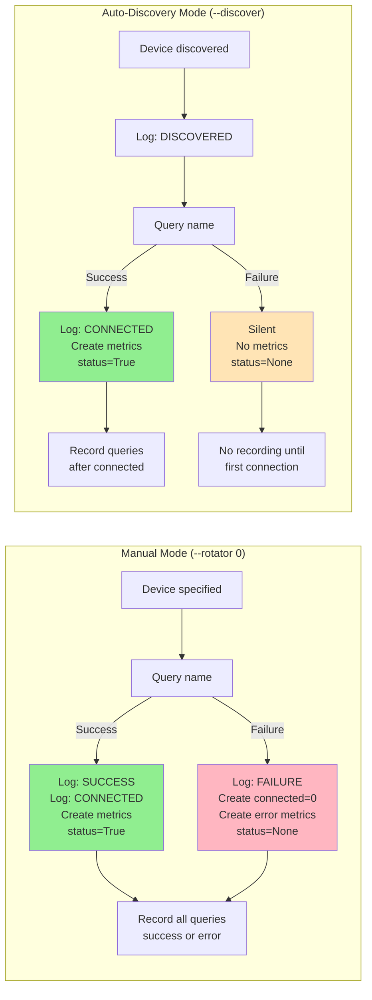
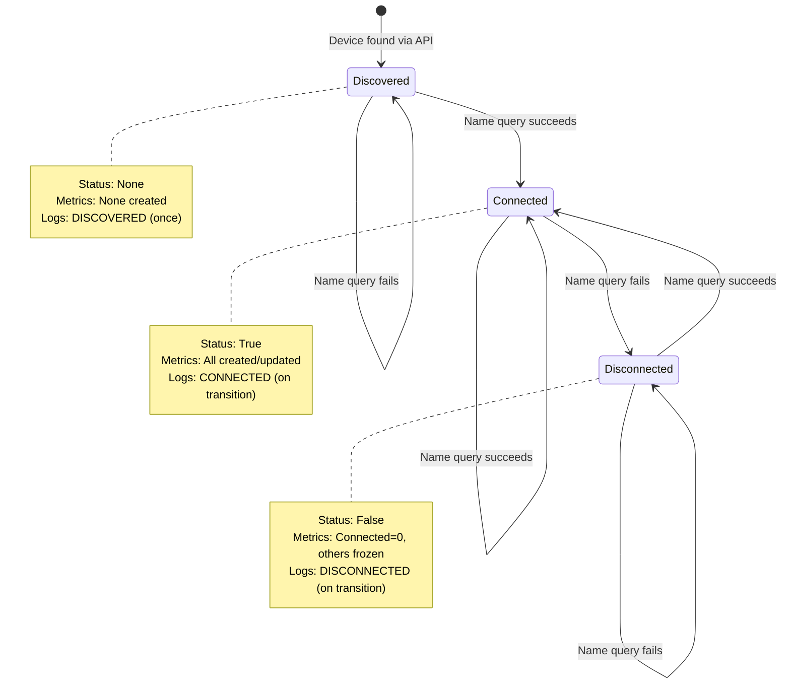
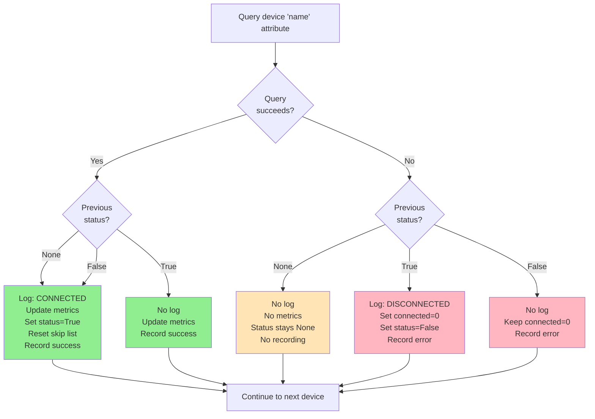
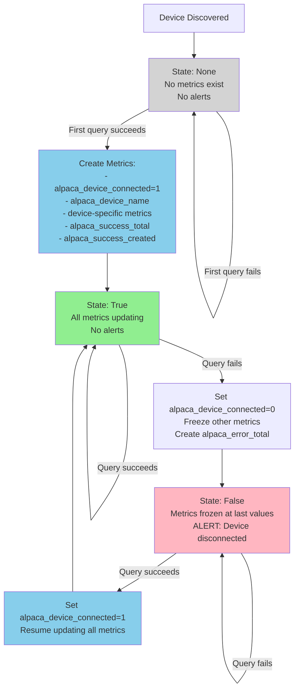
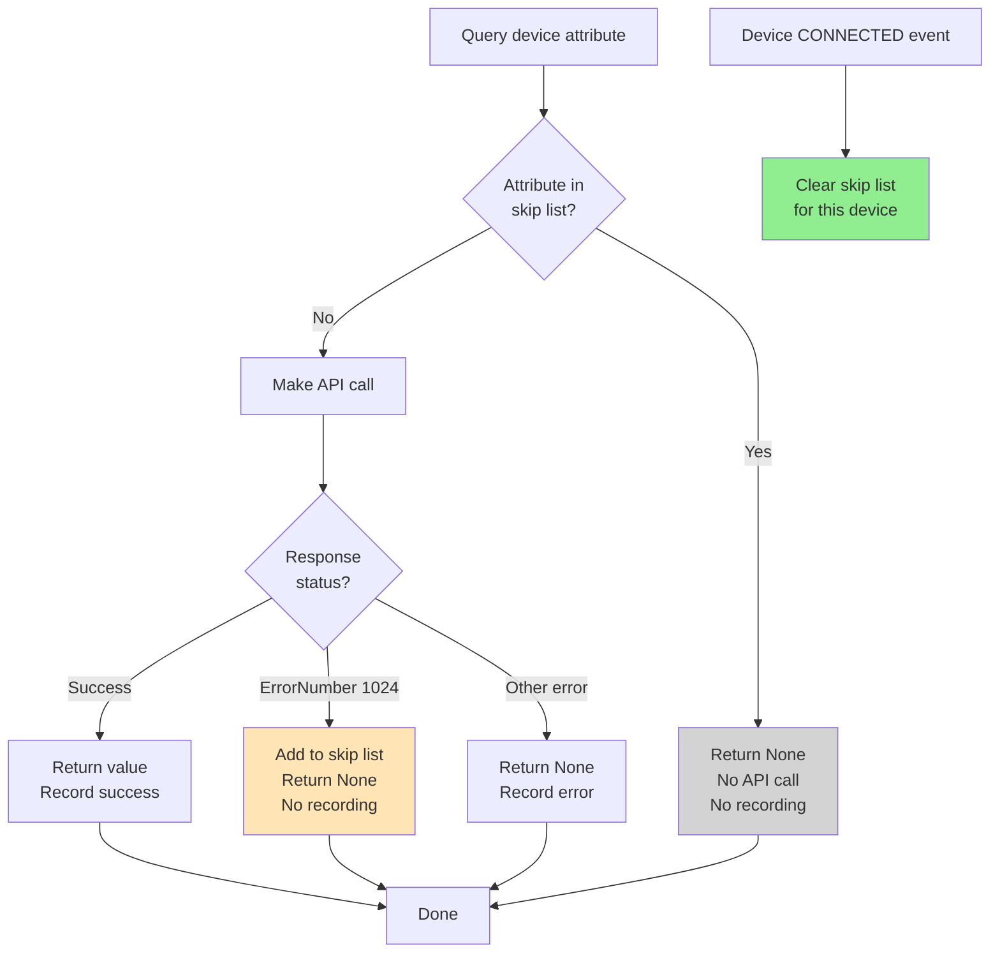

# WORK IN PROGRESS - Design Document

**Status:** This document is being refactored. It currently mixes requirements with design and implementation details.

---

# Requirements: Device Discovery and Metric Management

## Overview

This document defines the rules and behavior for device discovery, connection tracking, logging, and metric creation in the alpaca-exporter.

## Operating Modes

The exporter supports two mutually exclusive modes:

### CLI Usage

**Auto-Discovery Mode:**
```bash
python alpaca-exporter.py --discover
```

**Manual Configuration Mode:**
```bash
python alpaca-exporter.py --telescope 0 --camera 0 --camera 1
```

**Validation:** Using both `--discover` and explicit device flags is an error. Must specify one or the other.

### Mode Characteristics

| Aspect | Manual Mode | Auto-Discovery Mode |
|--------|-------------|---------------------|
| Device list | Static (from CLI args) | Dynamic (from Management API) |
| Never-connected device | `alpaca_device_connected=0` immediately | No metrics created |
| Error recording | Yes, from first query | No, only after first connection |
| Startup logs | SUCCESS/FAILURE per device | Only DISCOVERED |
| Use case | "Must monitor these specific devices" | "Monitor whatever is available" |

### Mode Behavior Diagram



## Device States

Devices transition through three states:

1. **Discovered** (status=`None`) - Found via API but never successfully connected
2. **Connected** (status=`True`) - Responds successfully to queries  
3. **Disconnected** (status=`False`) - Previously connected but now unresponsive



## Device Processing Logic

Each collection cycle queries the device `name` attribute to check connectivity. The following flow determines logging, metrics, and recording behavior:



## Metric Lifecycle

**Core Principle:** Metrics are ONLY created when a device first successfully connects.

This prevents false alerts for devices that are configured but never used, offline at startup, or placeholder configurations.



## Success/Error Metric Recording

`alpaca_success_total` and `alpaca_error_total` track API call reliability for connected devices.

**Rules:**
- **Auto-Discovery Mode:** Only record after device has connected once (status ≠ `None`)
- **Manual Configuration Mode:** Record all queries, including initial attempts (status is irrelevant)

**Rationale:** In discovery mode, never-connected devices are noise. In manual mode, never-connected devices are configuration errors that should be tracked.

## Skip List Management

The skip list prevents repeated queries to attributes that return ErrorNumber 1024 (not implemented by driver).

**Structure:**
```python
skip_device_attribute = {
    "device_type": {
        "device_number": ["attribute1", "attribute2"]
    }
}
```

**Lifecycle:**
- **Add:** When attribute returns ErrorNumber 1024
- **Clear:** On every CONNECTED event (reconnection may use different driver with different capabilities)
- **Scope:** Per device instance (camera/0 and camera/1 have separate lists)



**Example:** Camera/0 with Driver A returns ErrorNumber 1024 for `exposuremax`. Attribute is skipped. Camera disconnects and reconnects with Driver B. Skip list is cleared, `exposuremax` is queried again (Driver B may support it).

## Attribute Configuration

### Requirement: Explicit Definition

**Device attributes must be explicitly configured in YAML files** (one per device type in `config/` directory).

### Why Configuration Is Required

The ASCOM Alpaca API **does not provide attribute discovery/introspection**:

1. No `/properties` or similar endpoint exists
2. Properties are defined in [ASCOM Alpaca API specification](https://ascom-standards.org/api/) (fixed per device type)
3. Only detection method: Query the property and check HTTP status (200 = exists, 404 = doesn't exist) or ErrorNumber (1024 = not implemented by driver)

### Configuration File Structure

**Example (`config/rotator.yaml`):**
```yaml
metric_prefix: alpaca_rotator_

metrics:
- alpaca_name: ismoving
  metric_name: moving
- alpaca_name: mechanicalposition
  metric_name: position_mechanical
- alpaca_name: position
  metric_name: position_current
```

### Naming Convention

**ASCOM:** Lowercase, no separators (`mechanicalposition`, `cooleron`, `ccdtemperature`)

**Exporter:** Snake_case, descriptive (`position_mechanical`, `cooling`, `ccd_temperature`)

**Rationale:** Follows Prometheus conventions, improves readability, disambiguates similar properties.

### Maintenance

- Each new device type requires a YAML configuration file
- Attributes can be added/removed per deployment needs
- Only configured attributes are queried (reduces API calls)
- Metric name translations are optional

## Implementation Requirements

### State Tracking

The exporter must maintain:

1. **`device_status` dictionary**
   - Key: `"{device_type}/{device_number}"`
   - Value: `True` (connected), `False` (disconnected), `None` (never connected)

2. **`all_known_devices` dictionary** (discovery mode only)
   - Tracks all devices ever discovered
   - Used to detect devices removed from configuration

3. **`skip_device_attribute` dictionary**
   - Tracks ErrorNumber 1024 responses per device
   - Structure: `{device_type: {device_number: [attribute_list]}}`

### Function Signature

```python
getValue(alpaca_base_url, device_type, device_number, attribute, querystr="", record_metrics=True)
```

- `record_metrics=True`: Increment success/error counters (for actual metric collection)
- `record_metrics=False`: Don't increment counters (for initial connectivity checks in discovery mode)

### Continuous Discovery

When using `--discover` flag:

**Every Collection Cycle:**
1. Query Alpaca Management API (silent - no repeated DISCOVERED logs)
2. Compare discovered devices with `all_known_devices`
3. If new device found: Add to `all_known_devices`, log `NEW DEVICE: {device_type}/{device_number}`
4. Process ALL devices in `all_known_devices` (not just currently discovered)
   - Detects devices removed from configuration
   - Tracks devices that become unreachable

**Benefits:**
- Hot-plug support: New devices automatically monitored
- Dynamic configuration: Devices added/removed in NINA are detected
- No restart required

## Alert Design Guidelines

### Recommended Alert Patterns

**Device Offline:**
```promql
alpaca_device_connected{device_type="telescope"} == 0
```

Fires only for devices that successfully connected once and are currently offline. Never-connected devices won't trigger (metric doesn't exist).

**API Error Rate:**
```promql
rate(alpaca_error_total[5m]) > 0.1
```

Tracks error rate for actively monitored devices (have connected before).

## Configuration Files

Device-specific behavior is defined in `config/{device_type}.yaml`:

- `metric_prefix`: Prepended to all metric names
- `labels`: Device-specific labels (optional)
- `metrics`: List of Alpaca attributes to expose as Prometheus metrics

See individual device config files for examples.

---

**Generated By:** Cursor (Claude Sonnet 4.5)

