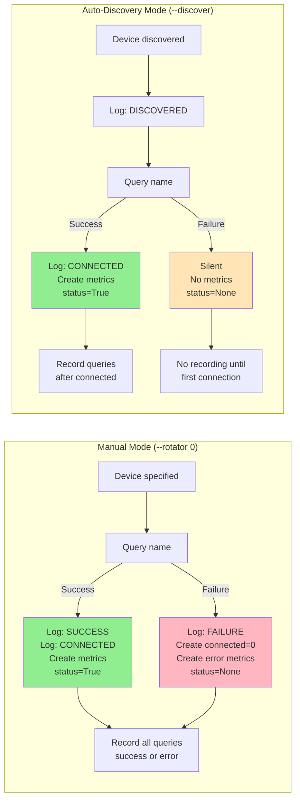
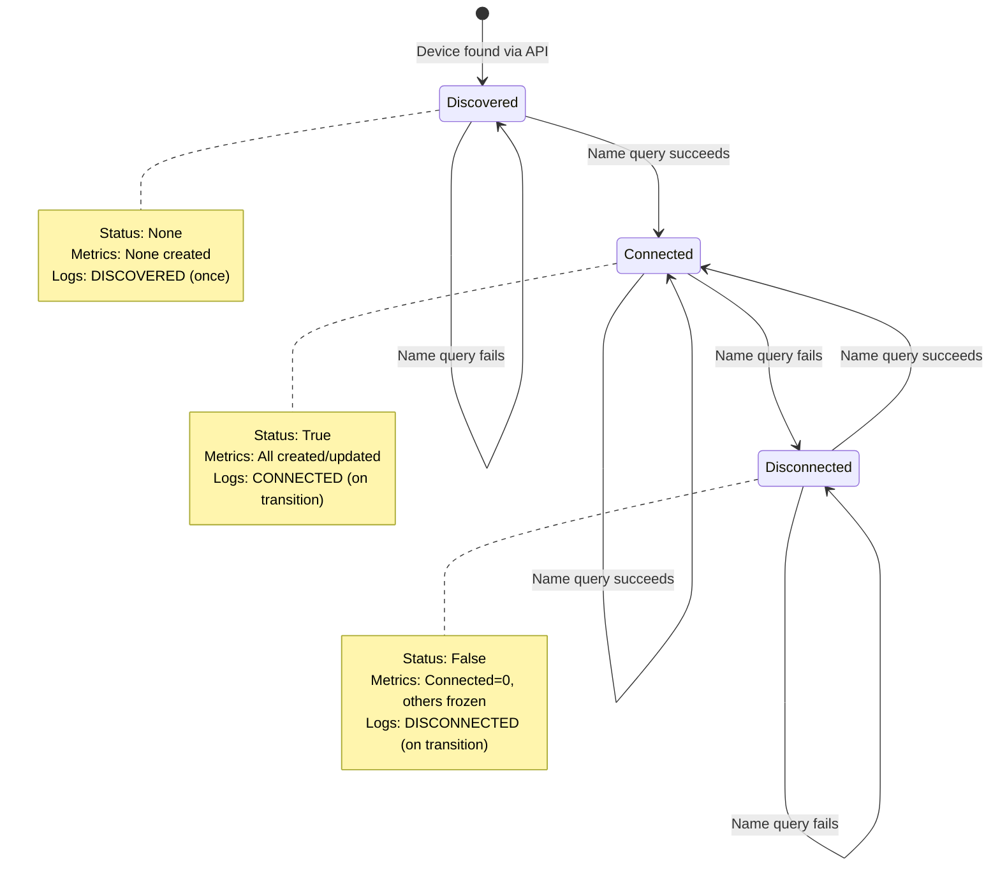
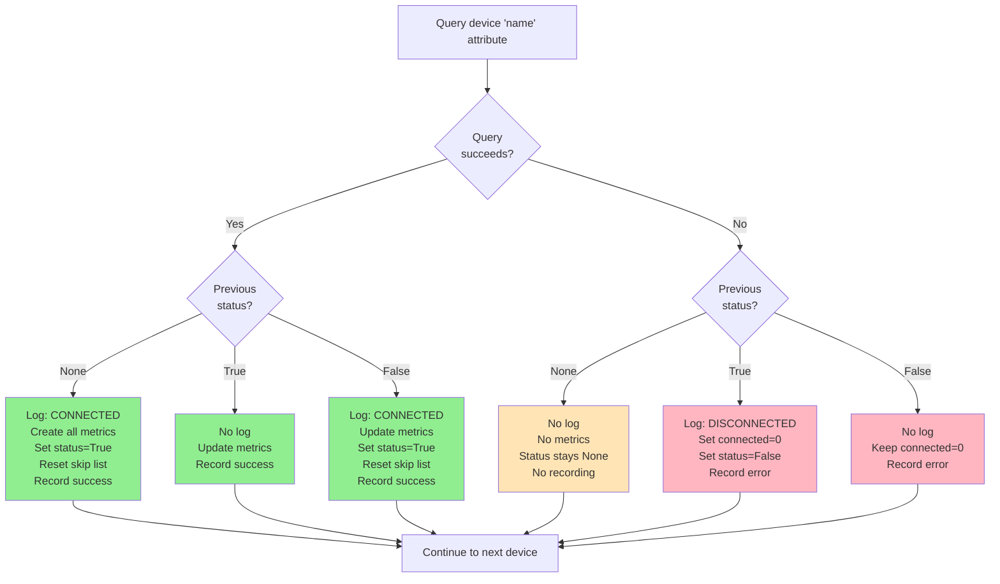
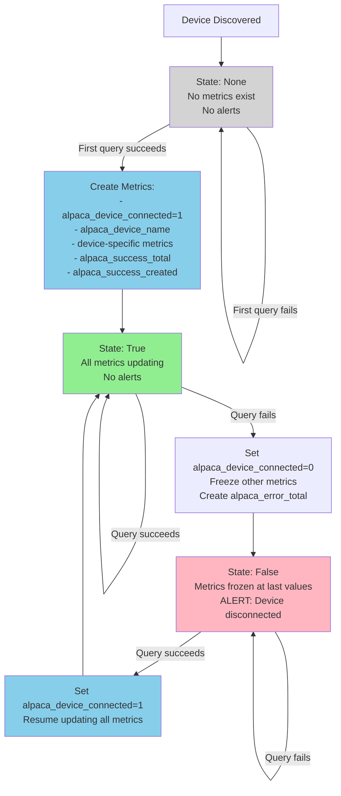
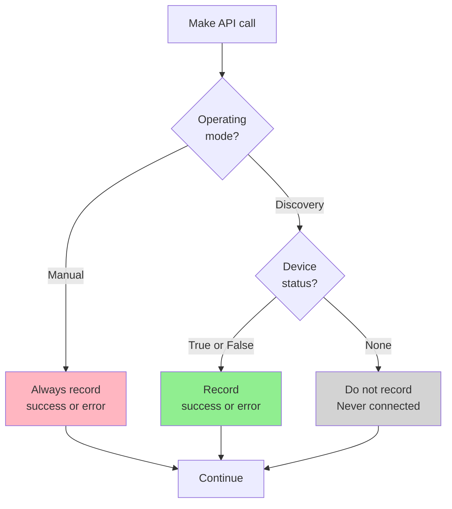
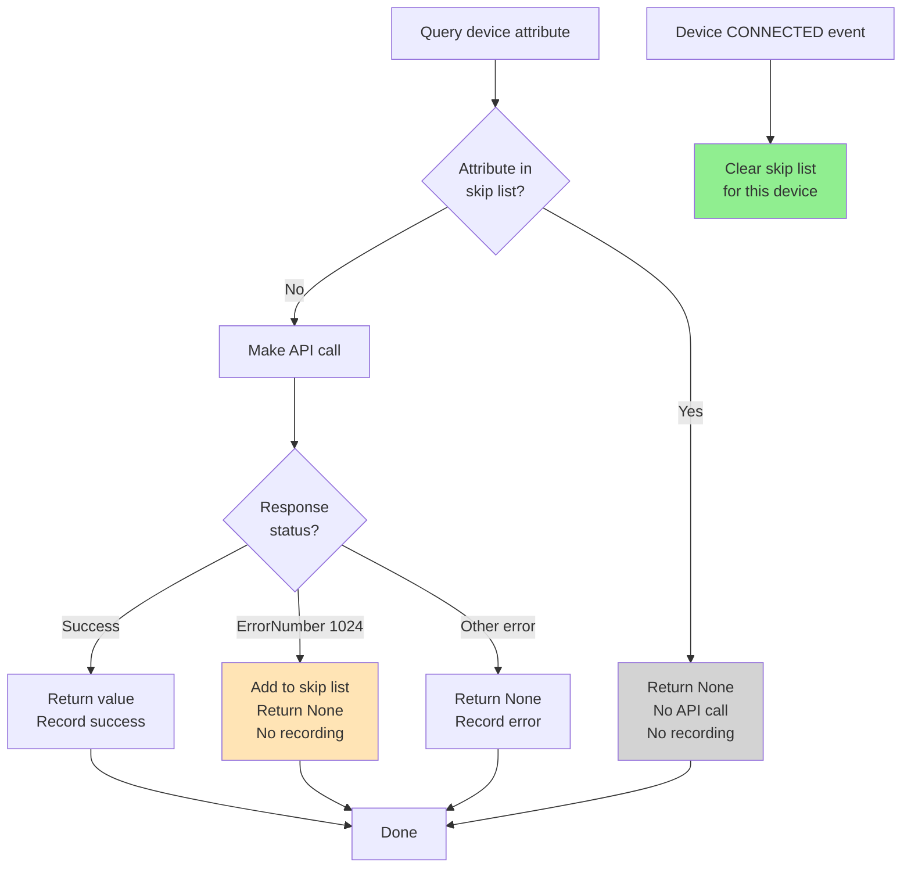

# Requirements: Device Discovery and Metric Management

## Overview

This document defines the rules and behavior for device discovery, connection tracking, logging, and metric creation in the alpaca-exporter.

## Operating Modes

The exporter supports two modes of operation:

### Auto-Discovery Mode (`--discover`)

**Behavior:** Permissive - query Alpaca Management API for configured devices and monitor whichever ones respond.

**Characteristics:**
- Device list from Alpaca Management API (dynamic)
- Devices that never connect are silently ignored
- No metrics created for never-connected devices
- Use case: "Monitor whatever is available in the environment"

### Manual Configuration Mode (`--device_type N`)

**Behavior:** Strict - explicitly specified devices must be monitored, failure to connect is an error.

**Characteristics:**
- Device list from command-line arguments (static)
- All specified devices create `alpaca_device_connected` metric immediately
- Never-connected devices: `alpaca_device_connected=0` with error metrics
- Startup logs: `SUCCESS: found device/0` or `FAILURE: unable to find device/0`
- Use case: "Must monitor these specific devices"

**Key Difference:**

| Aspect | Manual Mode | Auto-Discovery Mode |
|--------|-------------|---------------------|
| Never-connected device | `alpaca_device_connected=0` immediately | No metrics created |
| Error recording | Yes, from first query | No, only after first connection |
| Startup behavior | Log success/failure for each device | Only log discovery |

### Mode Comparison Diagram



## Device States

Devices can be in one of three states:

1. **Discovered** - Device found via Alpaca Management API but never successfully connected
2. **Connected** - Device responds successfully to API queries  
3. **Disconnected** - Device previously connected but now unresponsive

### State Diagram



## State Transitions and Logging

### Device Processing Flow Chart



### Startup Discovery

When the exporter starts with `--discover` flag:

- Query Alpaca Management API for configured devices
- Print `DISCOVERED: {device_type}/{device_number} - {device_name}` for each found device
- Do **NOT** create any metrics yet

### First Connection Attempt

For each discovered device, attempt to query the `name` attribute to verify connectivity:

**If successful:**
- Print `CONNECTED: {device_type}/{device_number}`
- Create `alpaca_device_connected` metric set to `1`
- Create `alpaca_device_name` metric
- Create all device-specific metrics defined in config
- **Start recording** `alpaca_success_total` and `alpaca_error_total` for this device

**If unsuccessful:**
- Do **NOT** print any message (device never connected)
- Do **NOT** create any metrics
- Do **NOT** record to `alpaca_success_total` or `alpaca_error_total`
- Mark internal state as "never connected"

### Subsequent Checks (Device Was Previously Connected)

**If device responds:**
- No message printed (remains connected)
- Update all metric values
- Record successful API calls to `alpaca_success_total`

**If device fails to respond:**
- Print `DISCONNECTED: {device_type}/{device_number} not responding`
- Set `alpaca_device_connected` to `0`
- Keep metric in `metrics_current` list
- Record failed API calls to `alpaca_error_total`
- Mark internal state as disconnected

### Reconnection (Device Was Previously Connected, Then Disconnected)

**When device responds again after being disconnected:**
- Print `CONNECTED: {device_type}/{device_number}`
- Set `alpaca_device_connected` back to `1`
- Resume collecting all device metrics
- Record successful API calls to `alpaca_success_total`

### Device Removed from Configuration

**If device was previously connected but no longer appears in discovery:**
- Print `DISCONNECTED: {device_type}/{device_number} no longer discovered`
- Set `alpaca_device_connected` to `0`
- Keep metric in `metrics_current` list

## Metric Creation Rules

### Core Principle

**Metrics are ONLY created when a device first successfully connects.**

This prevents false alerts for:
- Devices configured in NINA but never connected
- Devices that are offline at startup
- Test/placeholder device configurations

### Metric Lifecycle



1. **Never Connected Device**
   - No metrics exist
   - Alert rules checking `alpaca_device_connected == 0` will NOT fire (metric doesn't exist)

2. **First Successful Connection**
   - `alpaca_device_connected` metric created with value `1`
   - All device-specific metrics created
   - Device now "known" to monitoring system

3. **Device Disconnects**
   - `alpaca_device_connected` set to `0`
   - Alert rules checking `alpaca_device_connected == 0` WILL fire
   - Other device metrics stop updating but retain last value

4. **Device Reconnects**
   - `alpaca_device_connected` set to `1`
   - All metrics resume updating
   - Alert resolves

## Success/Error Metric Recording

### Purpose

`alpaca_success_total` and `alpaca_error_total` track API call reliability for **connected devices only**.

### Recording Decision Flow



### Recording Rules

**Auto-Discovery Mode:**

DO record when:
- Device has connected at least once (internal state is not `None`)
- Making ANY API call to that device (successful or failed)

DO NOT record when:
- Device has never successfully connected (internal state is `None`)
- This includes initial connectivity checks using the `name` attribute

**Manual Configuration Mode:**

DO record when:
- Device specified on command-line (regardless of connection state)
- Making ANY API call to that device, including initial `name` query
- Never-connected devices increment `alpaca_error_total` from first failed query

### Rationale

**Auto-Discovery Mode:**
Recording API metrics for never-connected devices would create noise in monitoring dashboards and make it difficult to distinguish between real connectivity issues and devices that are simply not configured/in use.

**Manual Configuration Mode:**
Recording errors immediately helps identify misconfiguration or deployment issues. If a user explicitly specifies `--telescope 0`, they expect that device to exist, and failure is an error state that should be tracked.

## Skip List Management

### Purpose

The skip list tracks attributes that return ErrorNumber 1024 (not implemented) for specific devices, preventing unnecessary API calls.

### Structure

```python
skip_device_attribute = {
    "device_type": {
        "device_number": ["attribute1", "attribute2"]
    }
}
```

### Lifecycle

**Adding to Skip List:**
- Attribute returns ErrorNumber 1024 (not implemented)
- Added to skip list for that device instance
- Subsequent queries return `None` immediately without API call

**Clearing Skip List:**
- When device connects (any CONNECTED event)
- Skip list reset to empty for that device instance
- Rationale: New connection may have different driver with different capabilities
- Each device instance (camera/0, camera/1) has separate skip list

### Skip List Flow Chart



### Example

1. Device camera/0 connects with Driver A
2. Query `exposuremax` → ErrorNumber 1024
3. `skip_device_attribute["camera"]["0"] = ["exposuremax"]`
4. Camera/0 disconnects, then reconnects with Driver B
5. On CONNECTED: `skip_device_attribute["camera"]["0"] = []` (reset)
6. Next cycle queries `exposuremax` again (not skipped)

## Implementation Requirements

### State Tracking

The exporter must maintain:

1. **`device_status` dictionary**
   - Key: `"{device_type}/{device_number}"`
   - Value: `True` (connected), `False` (disconnected), `None` (never connected)

2. **`all_known_devices` dictionary** (discovery mode only)
   - Key: device_type
   - Value: list of device_numbers ever discovered
   - Used to detect devices removed from configuration

### Function Signatures

```python
getValue(alpaca_base_url, device_type, device_number, attribute, querystr="", record_metrics=True)
```

- `record_metrics=False`: Don't increment success/error counters (used for initial connectivity checks)
- `record_metrics=True`: Increment counters (used for actual metric collection)

### Metric Management

When a device disconnects:
- Keep metric in `metrics_current` list during that collection cycle
- Prevents metric cleanup logic from removing it
- Allows `alpaca_device_connected=0` to persist for alerting

## Continuous Discovery

When using `--discover` flag:

### Every Collection Cycle

1. Query Alpaca Management API (silent - no log messages)
2. Compare discovered devices with known devices
3. If new device found:
   - Add to `all_known_devices`
   - Print `NEW DEVICE: {device_type}/{device_number} added to monitoring`
4. Process all devices in `all_known_devices` (not just currently discovered)
   - Allows detection of devices that were removed from configuration
   - Allows tracking of devices that become unreachable

### Benefits

- Hot-plug support: New devices automatically monitored
- Dynamic configuration: Devices added/removed in NINA are detected
- No restart required: Exporter adapts to environment changes

## Alert Design Guidelines

### Recommended Alert Patterns

**Device Offline Alert:**
```promql
alpaca_device_connected{device_type="telescope"} == 0
```

This will ONLY fire for devices that:
1. Successfully connected at least once
2. Are currently offline

**Devices Never Present:**
Devices that never connected will NOT have the metric, so alert won't fire (intended behavior).

**API Error Rate Alert:**
```promql
rate(alpaca_error_total[5m]) > 0.1
```

This tracks error rate for devices that are actively monitored (have connected before).

## Configuration Files

Device-specific behavior is defined in `config/{device_type}.yaml`:

- `metric_prefix`: Prepended to all metric names for this device type
- `labels`: Device-specific labels to add to all metrics
- `metrics`: List of Alpaca attributes to expose as Prometheus metrics

See individual device config files for examples.

---

**Generated By:** Cursor (Claude Sonnet 4.5)


